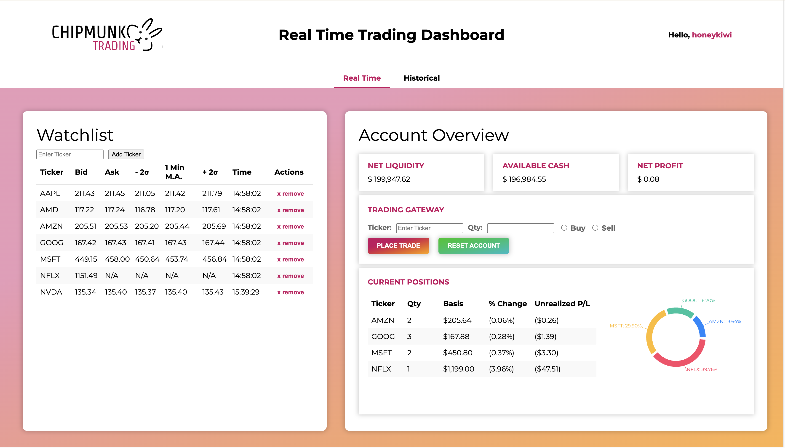
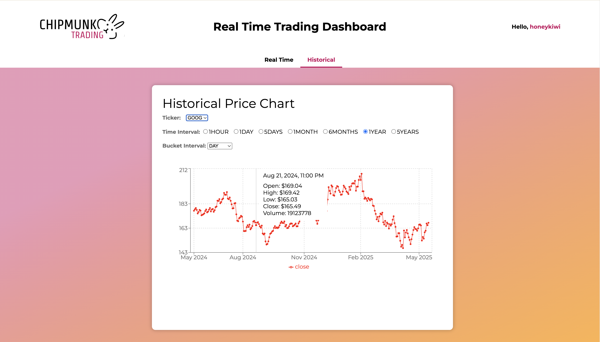

# A Real-Time Trading Dashboard 

## Contents
- [Introduction](./README.md#introduction)
- [System Design](./README.md#system-design)
- [Part 1: Market Data](./README.md#market-data)
- [Part 2: Stream Handling](./README.md#stream-handling)
- [Part 3: Database Tables](./README.md#database-tables)
- [Part 4: Backend Servers](./README.md#backend-servers)
- [Part 5: Dashboard](./README.md#dashboard)
- [Tradeoffs and Future Items](./README.md#tradeoffs-and-future-items)

## Introduction
In this project, I explore how to build a real-time data streaming pipeline featuring a dashboard with a watchlist, P/L tracking, a trading gateway, and a historical prices chart. The code implements the data flow end-to-end, starting from receiving market data from the IEX exchange to displaying it dynamically on a dashboard with real-time updates. In the following sections, we break down the overall system design followed by deep-dives into each component and insights drawn from the implemention process. Lastly, we will recap the tradeoffs this project made as well as future extensions that are possible.




## System Design

In this section, we discuss the system design at a high level. Note that this stack mainly uses Postgres SQL, Python, and React

The table below describes the stack and function of each component, further details regarding the design are discussed in each respective section.

| Component           | Specification            | Description                                                                                     |
|---------------------|--------------------------|-------------------------------------------------------------------------------------------------|
| Data Ingestor       | Alpaca API               | Creates a connection with the exchange through the broker middleman and streams live prices     |
| Backend Servers     | Redis Pub/Sub, Fast API  | Receives the streamed data into the backend ecosytem and delivers data to subscribed components |
| Database            | Postgres, SQL, TimeScale | Stores application state including user account info and time-bucketed market prices            |
| Dashboard           | React, Websockets        | Displays data in a meaningful way for a trader, including a watchlist, P/L tracking, and metrics|

## Market Data

### Brokerage Background Info
Typically, software cannot directly access exchanges; instead, brokers like Alpaca act as the middleman and provide access to market data through an API. This can be thought of as the 'data source' in a real-time data pipeline and could very well also be sensor data etc. in other fields and applications. In this case (through the free account), the IEX exchange provides several pieces of information regarding instrument prices including: historical bars (open, high, low, close), quotes (bid, ask, volume, status), and trades. For the purposes of this project, we use the historical bars (for historical price charts) and quotes streaming (for real-time data).

### Websockets Explained
In a naive approach, an application might want to keep checking the current stock price every `X` number of seconds in a process called 'polling'. But polling can be inefficient for several reasons, including wasting time, flooding the server with too many requests, and limiting the application data input rate to the worst-case polling increment. Instead, real-time applications would much rather use an 'event-driven' architecture. This can be done in three ways:

1. WebHooks: Client gives the server a public endpoint saying 'Whenever your event data is ready, send a message to this endpoint!'
   1. These are good for a lot of async applications, uni-directional, and with clients that are okay to expose a public endpoint
2. WebSockets: Establish a long-running *bi-directional* TCP connection through an `UPGRADE` message
   1. Pros: low-latency, reduced HTTP overhead, in which the client can also send messages to the server to modify server state
   2. Cons: connections need to be re-established if the client ever disconnects and its hard to manage a lot of active websocket connections at scale
3. HTTP Streaming: Client sends a request to the server, which responds with an infinitely long response
   1. Typically uni-directional and data arrives in chunks
 
### Streaming in the Project
In this use-case, WebSockets was offered by the Alpaca API, but to communicate between the backend server and dashboard, WebSockets were also used there to allow the dashboard to (potentially) subscribe and unsubscribe to certain tickers. Note that when establishing a WebSocket connection with Alpaca, all tickers that you want to listen to need to be specified in advance and provided an async message handler; so in this case, because I had only a few tickers I was tracking, I chose to fetch all data at once and have the dashboard only selectively show data based on user preferences.

#### WebSockets for Data Ingestion

```python
# cache the data by ticker (key) and publish on all channels (topics)
async def store_and_publish(self, key: str, data_dict, channels: list[RedisChannel], keyspace:str = 'ticker'):
    self.redis_client.set(f"{keyspace}:{key}", json.dumps(data_dict))
    
    for channel in channels:
        self.redis_client.publish(channel.value, json.dumps(data_dict))

# establish the connection
self.alpaca_client = StockDataStream(ALPACA_API_KEY, ALPACA_SECRET_KEY, raw_data=True)
self.alpaca_client.subscribe_quotes(self.quote_data_handler, *(tickers)) 
self.alpaca_client.run()

# preprocess the received data and send it to the producer component that will notifiy all listeners
await self.redis_client.store_and_publish(key=data['S'], data_dict=quote_dict, channels=[RedisChannel.QUOTE_UPDATES])
```

#### WebSockets for Dashboard Updates
```javascript
// establish the connection with server
socket.current = new WebSocket("ws://localhost:8000/ws");
const socket_obj = socket.current;

// message handling
const handle_message = (message) => {
    const data = JSON.parse(message.data); // we get a message object, from which we need message.data

    setStockData( (prevData) => {
        const updated_data = {...prevData, [data.ticker]: {...data, timestamp: formatTime(data.timestamp)}};
        localStorage.setItem('watchlist_stock_data', JSON.stringify(updated_data));
        return updated_data;
    });
};

// add the event listener
socket_obj.addEventListener("message", handle_message);
```

## Stream Handling
Raw data arrives in string format rapidly and it requires several layers of processing before it is viable to use for any application built on top of the stream. 

### Rate Limiters (Leaky Bucket)
The first major challenge is putting a limit on the amount of messages our backend can process within a certain time-interval. In particular, we would like to rate-limit two quantities:
1. The total number of messages we process (through the `aiolimiter` python module)
2. The number of messages per ticker (to provide an equitable amount per symbol)

> The second is required because it quickly became apparent that the WebSocket stream most likely used a queue-like structure for updates and sent individual ticker market prices in bursts. This is not ideal for our application as we want all prices to update at equal rates and thus we explore the Leaky Bucket Algorithm in detail (can find implementation in `market_data_ingestors/quote_ingestor.py`). 

</br>
Below we see the specification of the Leaky Bucket Algorithm.

> NOTE: To fully grasp how the concurrent nature of this algorithm works, it is helpful to have programming experience with locks, channels, and the python asyncio library.

#### async def leak(leak_rate)
At its core, the algorithm depends on a queue, which will 'leak' at a fixed interval specified by the `leak rate`. As messages come in, they are enqueued and as they leak, they are published to the appropriate channel through the Redis Pub/Sub channels.

#### async def accept(message)
This method enqueues the message into the message queue accessed by `leak()`, but we can't always queue all of the messages we get, else, the queue will become very long since we are maintaining a strict limit for how fast the queue can 'leak' per ticker. Thus, we will only accept messages if the length of the queue is less than some threshold, else we drop the message.

#### async def refresh()
This is where the magic occurs! We could set the threshold used in the `accept()` method to be fixed, however, that wouldn't respect the burst nature of the incoming stream. Instead, we can make this threshold dynamic! When the length of the queue is under some `IDLE_CAPACITY`, the longer it stays there, the more likely a burst is incoming. To accomodate this, at a `refresh_rate` we increase the accept threshold indefinitely until the burst arrives. When the burst finally arrives, we can accomodate up to the new accept threshold. At this point, the queue is likely much longer than the `IDLE_CAPACITY`, and `refresh()` does nothing here. Instead, whenever, `leak()` triggers, it sets the threshold to be `max(current_threshold - 1, IDLE_CAPACITY)`, this way, if the threshold is currently high due to burst, it will accommodate and slowly shrink it, otherwise, it will make sure it is at least at the `IDLE_CAPACITY` when in 'normal' mode.

### Topic Listeners
The second major challenge is being able to deliver messages on an event-driven basis to all the components of the system. Redis Pub/Sub is one such method! Essentially, there are message topics that producers can publish to and listeners can subscribe to. When a message is sent to the topic, all listeners are notified at once! This way, each time we `leak()` a message for a particular ticker, we will push it to the `QUOTES_UPDATES` topic and all data pipelines that depend on quotes data will be notified.

</br>

Each listener to these topics must implement their own form of event-driven logic. The magic happens using the Python `asyncio` package and the keywords `await` and `yield`. Essentially, the consumer will run an infinite loop in which they wait to run logic until a message arrives and when that data arrives, the main loop unblocks. But we don't want the program to hang when this function is called just waiting for a message, we want it to give up control to the Python main thread to execute other functions while we wait. Here, we have a helper function spawn a thread and `await` the message from the topic and subsequently `yield` it; while we await, the main Python thread is free to work on other tasks (requests in the case of a server)!

### Data Cleaning

As with any timeseries data, we will need to clean it from the raw format and produce a dict consumable by any applications. In this case, the data is eventually cleaned to be in this format:

```python
quote_dict = {
    'ticker': data['S'], 
    'bid_price': data['bp'], 
    'bid_qty': data['bs'],
    'ask_price': data['ap'],
    'ask_qty': data['as'], 
    'timestamp': str(data['t'].to_datetime())
}
```

## Database Tables

There are 4 core tables the dashboard uses; the schemas are fairly straightforward and queries used for setup are included in `database_utils/db.sql`. Below, I provide some notes on interesting design choices.

### Time Series Data

`quotes_time_series` is the core table here. Essentially for each (ticker, timestamp) combo, it generates a unique id and stores it along with other info, such as those found in the `quote_dict` above. Few things to note here:

- Postgres actually supports the timestamp data-type which is very useful for timeseries data
- Because of the large scale of data, I put an expiration date of 1 week, which query I could run to clean out the database manually at a later time
- The data was also aggregated into smaller batches on the server side as it consumed from the stream and inserted periodically for efficiency; the tradeoff was that the batches themselves were in memory and would be lost if the server was halted abruptly, but the batches were fairly small.
- A separate MATERIALIZED VIEW, `quotes_minute_buckets` was also created using Timescale DB continuous aggregates to help make the data more usable for calculations; the granularity set was 1 minute buckets 

### Account and Trade Data

Here, there are 3 core tables:

1. `user_info`: Contains information regarding a unique user id and login information. This is a possible route for future work, learning how to make secure accounts. 
2. `trading_account_info`: Core trading account diagnostic info such as available cash, P/L, and liquidity. The trading gateway directly interacts with this table for updating the results of placed trades and risk monitoring.
3. `user_positions`: Info regarding the user's nonzero holdings. As trades are placed and the user either opens or closes positions, this table is updated and referenced for dashboard metrics. 

> NOTES
> 
> In the user_info table, a user id must be unique, password hashes are also stored with salts. Currently, there is only one testing user, `honeykiwi`.
> 
> For the trading account, because it is a paper trading account, it can be reset. It doesn't fully connect with the exchange, but it would be a very simple extension to simply forward the trades entered into user_positions to the Alpaca client along with generated API keys from their website.
> 
> The `user_positions` table enforces a CONSTRAINT that each data record must have a unique (user_id, ticker) combination to avoid any bookkeeping issues.

## Backend Servers


- pip3 install websocket
- pip install aiolimiter
- brew install postgresql@17
- brew install redis
- pip install redis asyncio
- brew install node
- npm install react react-dom
- npm install --save-dev parcel
- npm start
- pip freeze > requirements.txt (pretty cool for dependencies)

<br>
rate limiter with leaky bucket

<br>
redis-server

<br>
pip install "fastapi[standard]" - similar to node.js and flask, but has better data validation, using websocket for streaming

<br>
read more about parcel, redis, fastapi

<br>

- step 1 was to get a flow of prices from back to front for 1 stock
- step 2 is to get a flow of prices for 2 stocks

<br>

- need to add info about why we choose postgres and diff b/w postgres and sql, and why not choose timescale bc its not free (i think)
- brew services start postgresql@17 / brew services stop postgresql@17
- pip install psycopg2-binary (postgres adaptor for python)
- createuser -s postgres
- psql -U postgres
- "-#" means we are in a multiline statement, so we can use \q to get out of the psql console and restart
- change database.ini for postgres user details
- 
- CREATE ROLE newuser WITH LOGIN PASSWORD 'password';
- GRANT ALL PRIVILEGES ON DATABASE your_database TO newuser;
- ALTER DATABASE quotes_time_series OWNER TO dashboard_admin;
- SELECT grantee, privilege_type FROM information_schema.role_table_grants WHERE table_name = 'trading_account_info';
- SELECT tablename, tableowner FROM pg_tables WHERE tablename = 'trading_account_info';
- GRANT ALL PRIVILEGES ON TABLE user_positions TO dashboard_admin;
- GRANT USAGE, SELECT, UPDATE ON SEQUENCE user_positions_position_id_seq to dashboard_admin;


- \dt is tables, \l is databases \du is users \d [table name] gives schema access, \dt+ shows tables and sizes
- maybe create a single database and have multiple tables so we can join based on ticker
- add sql to insert
- add sql to remove stale data from the ticker that we get last in the query for that batch, write batched updates
- want to prioritize fast inserts because we aren't going to necessarily be modifying or deleting rows

<br>
redis optim

- create base redis client, producer, consumer, and runner class
- now to run components, from the rootdirectory, we run for example, `python -m backend_servers.real_time_quote_server`

<br>

- react passes in props as an object
- for json, we need to get data using message.data
- NOTE: IT IS POSSIBLE FOR PRICE TO BE 0 IF THAT SIDE OF THE ORDER BOOK IS EMPTY
- ? means optional param
- having () in onclick means it executes when rendered, need ref, so without () for it to work properly
- const is not mutable in js
- react re-renders each component every time the list of tickers changes, meaning that it comes back to null or 'waiting for updates' until it resends the subscribe message
  - to fix this, we actually handle the subs, unsubs in the watchlist itself and only pass data to the watchlist component, that way, the data isn't touched for the rest of the tickers
- use localStorage with JSON.stringify and JSON.parse to restore watchlist data from the previous session, reconnect to all tickers and restore old data
  - and do this in onOpen so that we can send 'subscribe' messages only when the socket is actually open, ALSO, note that react state is not updated immediately so do the reconnections from the localstorage directly

<br>

- brew tap timescale/tap
- brew install timescaledb libpq
- psql -U postgres -d market_data -c "CREATE EXTENSION IF NOT EXISTS timescaledb;"
- alter table quotes_time_series drop constraint quotes_time_series_pkey;
- alter table quotes_time_series add primary key (quote_id, ts)
- SELECT create_hypertable('quotes_time_series', 'ts', migrate_data => true);
- SELECT add_retention_policy('quotes_time_series', INTERVAL '90 days');
- db size: SELECT pg_size_pretty(pg_database_size('market_data')); 
- SELECT pg_size_pretty(pg_total_relation_size('quotes_time_series'));
- look into continuous aggregates
- market_data=# CREATE MATERIALIZED VIEW quotes_minute_buckets
market_data-# WITH (timescaledb.continuous) AS
market_data-# SELECT ticker, time_bucket('1 minute', ts) AS bucket, ( first(bid_price, ts) + first(ask_price, ts) ) / 2 AS first_price
market_data-# FROM quotes_time_series
market_data-# WHERE bid_price > 0 AND ask_price > 0
market_data-# GROUP BY ticker, bucket;
<br>

- market_data=# SELECT add_continuous_aggregate_policy('quotes_minute_buckets',
market_data(# start_offset => INTERVAL '14 days',
market_data(# end_offset => INTERVAL '1 minute',
market_data(# schedule_interval => INTERVAL '2 minutes');
<br>

<br>
user and trading account tables

- salt the passwords and store hashes
- have a foreign key for the user id and make sure that it is ON DELETE CASCADE
- NUMERIC(15, 4) means 15 digits of precision with 4 coming after the decimal place
- CONSTRAINT unique_user_ticker_combo UNIQUE(user_id, ticker)
- function + trigger comments written in db.sql

<br>

- ran into a CORS error, but can use FastAPI to get HTTPCORSMiddleware
  - allow certain origins, methods, and headers
- make post request using a dict with JSON.stringify, then do fetch with the method name, header, and body fields
- use pydantic to specify request type

<br>

- have account overview recompute each time accountData, positions, or stockData changes
- need to add additional verification on frontend and server that data structure / format is being checked for nullvalues etc. (esp on server-side for security)

<br>
css styling

- npm install recharts
- I could have used D3, but I chose this for ease of use, getting more progress in, and also realized most companies probably use charting libraries built on top of D3 instead of using it directly anyways
- ApexCharts and ChartJS are also something I'm looking into, I might try one of the other two for other types of charts

<br>

- http stuff: so apparently a get request can't have a body, so we have to use post for complex get queries (not sure if using post is the solution)
- also, if we are missing (res) => res.json() we actually get the response object and NOT the actual data

<br>
line charting

- whenever you wrap something in a <label> tag, you are basically saying that any elements wrapped by the tag that are clicked by the user will focus the input button/search bar etc.
- use ENUMS for time intervals

<br>

1. risk engine has queues for every ticker the user currently has a position in
2. at init, queries latest 60 minute-bars, calculates returns/differentials using pandas and also stores the latest price, calculates worst 5% return and sends snapshot of all percentages to the client in the web socket stream
3. Subscribe to minute-bars from the exchange and every time a new price comes in for something in our portfolio, recalculate, so T * nlogn op for n = 60 ; T = num_unique_tickers_in_portfolio, if len(queue) > 60, popleft the queue before calculating so we have the latest window, update latest price
4. Each time the user places a trade in the trading gateway, refresh the position, if it has disappeared, free the queue, if we are trading a new one, do step 2 for the newest ticker, else, do nothing (since client calculates the final VaR value)

- tradeoff might be having a global risk engine vs. an individual one per client, tradeoff is doing repeated work and refetching each time a client connects, extra logic
- upside of customized risk engine is faster updates bc less tickers, more granular control over hyperparameters like window, bucket size, percentiles, and method of calculations
